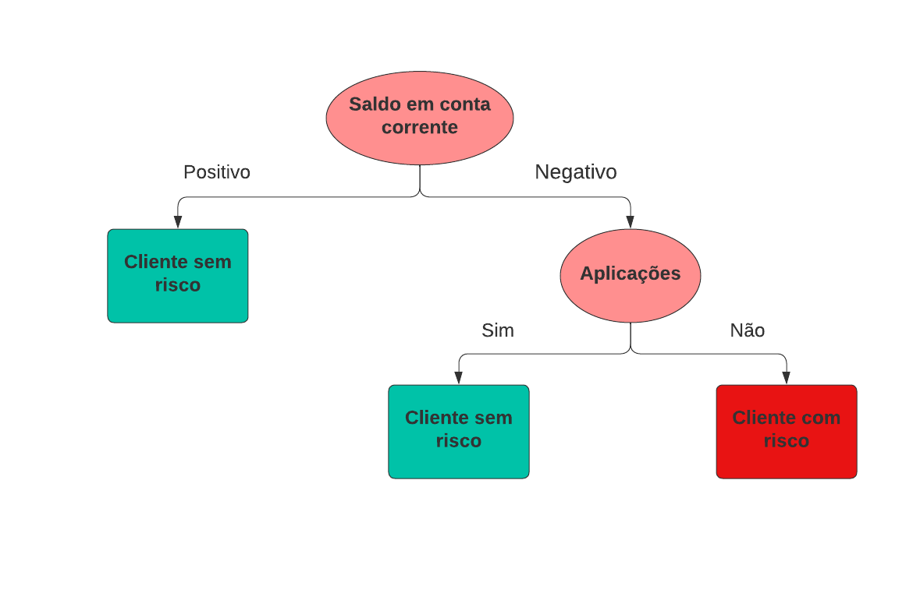

# ÁRVORES DE DECISÃO OU DECISION TREE

## Introdução ao Tema 🐉

Uma árvore de decisão é uma ferramenta de apoio a decisão, que graficamente apresenta a forma de uma árvore de cabeça para baixo. O conceito que rege os modelos de aprendizagem baseado em árvore de decisão consiste em definir um conjunto de regras e para cada regra há uma decisão que precisa ser tomada. O grande desafio então é fazer com que os computadores aprendam todas essas regras e automaticamente decidi por qual caminho seguir.

Árvores de decisão, classificam as instâncias de dados através de uma estrutura de ávore de cabeça para baixo. Para que a decisão ocorra o fluxo começa na raíz, existem então as condições ou checagem que vão determinar o próximo passo do fluxo, que são chamados de nós ou nodes. A decisão propriamente dita ocorre nas folhas. Traduzindo isso para a linguagem do algoritmo, os nós representam as variáveis ou atributos, os branchs ou ramos representam os valores que a os atributos podem assumir e as checagens de condições representam exatamente o valor de cada um dos atributos.

As árvores de decisão podem ser usadas para problemas de classificação ou regressão. Para problemas de classificação chamamos de árvores de classificação e para problemas de regressão chamamos de árvores de regressão.